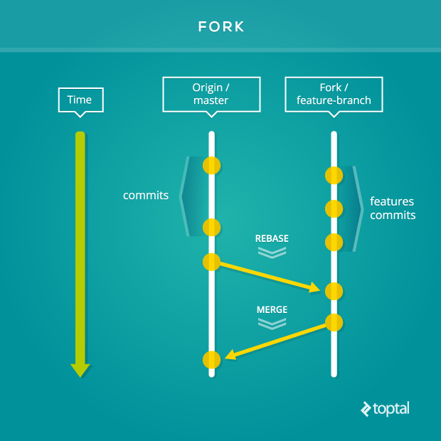

- [Contribuer au projet](#contribuer-au-projet)
  - [Code de conduite](#code-de-conduite)
  - [Qu’est ce que je peux faire](#quest-ce-que-je-peux-faire)
    - [Rapporter des bugs](#rapporter-des-bugs)
    - [Suggérer des améliorations ou de nouvelles fonctionnalités](#suggérer-des-améliorations-ou-de-nouvelles-fonctionnalités)
    - [Signaler des manques dans la documentation](#signaler-des-manques-dans-la-documentation)
    - [Contribuer au code](#contribuer-au-code)
  - [L'environnement de développement](#lenvironnement-de-développement)
    - [Prérequis](#prérequis)
    - [L’organisation du code](#lorganisation-du-code)
    - [Installer le projet](#installer-le-projet)
    - [Démarrer le projet](#démarrer-le-projet)
  - [La convention de codage (coding style)](#la-convention-de-codage-coding-style)
  - [La documentation](#la-documentation)
    - [Les ADR.s](#les-adrs)
    - [Le wiki de Github](#le-wiki-de-github)
  - [Les tests](#les-tests)
  - [Les bonnes pratiques](#les-bonnes-pratiques)
    - [Faire une Pull request](#faire-une-pull-request)
    - [le git flow](#le-git-flow)
    - [Conseils](#conseils)
  - [Trouver de l’aide](#trouver-de-laide)
    - [Dans une issue](#dans-une-issue)
    - [Au cours d’une pull request](#au-cours-dune-pull-request)
    - [Sur Slack](#sur-slack)
    - [Le wiki](#le-wiki)
    - [Aux Coding CaenCamp.s](#aux-coding-caencamps)

# Contribuer au projet

## Code de conduite

En participant, vous devez respecter le [code de conduite du projet](CODE_OF_CONDUCT.md).

## Qu’est ce que je peux faire

Beaucoup de choses, l’écriture de code n’étant pas l’unique manière de contribuer au projet !

### Rapporter des bugs :bug: 

Il parait que chaque bug relevé sauve un chaton. En tout cas, la technique du [ZBSD (Zero-Bug Software Development)](https://medium.com/quality-functions/the-zero-bug-policy-b0bd987be684) semble porter ses fruits, comme le rapporte [Andrew Fulton](https://medium.com/@andrew.fulton/how-we-got-to-zero-bugs-and-implemented-a-zero-bug-policy-c77ee3f2e50b).
Donc, si à chaque bug rencontré quelqu’un [ouvre une issue](#ouvrir-une-issue) avec le label **Bug** :bug:, ce seront des familles entières de chats qui seront sauvées.

### Suggérer des améliorations ou de nouvelles fonctionnalités :heart:

Dans ce cas, ouvrez une nouvelle issue de type **Amélioration** :heart: en décrivant bien votre idée.

### Signaler des manques dans la documentation :blue_book:

Si pendant votre participation au projet (que ce soit en l'utilisant ou en participant au code) vous n'avez pas réussit à faire quelque chose par manque de solution, signalez le en ouvrant une issue de type **Documentation** :blue_book: .

Et d'ailleurs n'hésitez pas à traiter cette issue en proposant un PR améliorant la documentation si vous avez trouvez une solution !

### Contribuer au code :seedling:

<!-- Topo sur le projet -->

## L'environnement de développement

Quelle que soit votre type d’implication, ce peut-être une bonne chose que d’installer le projet sur votre machine pour pouvoir visualiser votre contribution avant de la proposer sur Github.

### Prérequis

<!-- Décrire ce qui doit-être disponible sur un environnement de développement afin de pouvoir installer le projet et le lancer en local -->

### L’organisation du code

<!-- Description de l'organisation du code si cela vous semble utile. C'est souvent un plus dans la cas de monorepo ... -->

### Installer le projet

<!-- Les étapes nécessaires à l'installation du projet -->

### Démarrer le projet

<!-- Comment lancer le projet en locale -->

## La convention de codage (coding style)

<!-- Décrire les conventions de code du projet, et les outils de linting éventuels -->

## La documentation

Ce n'est pas toujours ce qu'il y a de plus facile à faire sur un projet : écrire une documentation permettant d'utiliser le produit, mais aussi permettant de participer à son élaboration. Et tout aussi difficile, maintenir cette documentation à jours.

Pourtant, et ceci d'expérience, ce sont le plus souvent les projets les mieux documentés qui gagnent l'adhésion de la communauté ! Voici donc les quelques méthodes et règle qui nous avons mis en place aux Coding Caen.Camp.s

### Les ADR.s

Nous utilisons les [ADR.s (Architectural Decision Records)](https://adr.github.io/) pour documenter les prises de décisions liées à l'architecture du projet.

Il existe par exemple un ADR sur [la mise en place des ADR.s](../doc/adr/ccc-jb-001-utiliser-les-adrs-pour-documenter-le-projet.md) :)

Vous trouverez plus d'information sur les ADR sur le dépôt [coding-caen-camp](https://github.com/CaenCamp/coding-caen-camp).

### Le wiki de Github

Github fourni un wiki pour chaque dépôt. Autant l'utiliser !

Nous suggérons donc d'utiliser le wiki pour y noter tous les *tips*, guides, remarques, astuces ... liées au projet.

## Les tests

Afin de faciliter l’intégration (le merge) de vos PR, surtout si elles ajoutent ou modifient du code, celles-ci devront contenir les tests couvrant vos propositions.

<!-- Décrire les outils de tests utilisés. -->

Les tests sont lancés sur la plateforme d’intégration continue de Github via les [Github actions](https://github.com/features/actions).

## Les bonnes pratiques

La bonne pratique, c’est de **faire des PR**, et puis c’est tout.

### Faire une Pull request

Si vous n’avez encore jamais fait de Pull Request (PR), la lecture du tutorial Github [Understanding the GitHub Flow](https://guides.github.com/introduction/flow/) est sûrement un bon point de départ.

Si vous n’aviez pas encore de compte Github, en voici une [bonne introduction](https://flaviocopes.com/github-guide/).

### le git flow

Pour le projet, nous utilisons le workflow suivant :

-   Le projet principal ne possède qu’une branche `main`.
-   Chaque participant réalise un [fork](https://guides.github.com/activities/forking/) du dépôt principal puis ouvre une [branche](https://help.github.com/articles/creating-and-deleting-branches-within-your-repository/) depuis son fork pour chaque nouvelle feature.
-   Une [PR](https://help.github.com/articles/about-pull-requests/) est créée depuis la branche du fork vers la branche `main` du dépôt principal.

Si vous vous sentez un peu perdu.e, la lecture de [Using the Fork-and-Branch Git Workflow](https://blog.scottlowe.org/2015/01/27/using-fork-branch-git-workflow/) devrait vous rendre plus serein.ne.

Vous trouverez aussi d'autres informations sur les PR sur le dépôt [coding-caen-camp](https://github.com/CaenCamp/coding-caen-camp).

### Conseils

Mais voici quelques conseils qui peuvent les rendre encore meilleures :

-   Faites des commits [courts et bien commentés](http://tbaggery.com/2008/04/19/a-note-about-git-commit-messages.html).
-   Faites des [PR courtes](https://dev.to/bosepchuk/optimal-pull-request-size-600), toute une tache (une issue) n’a pas forcement besoin d’être adressée dans une seule PR.
-   Faites référence à l’issue que la PR adresse.
-   N’hésitez pas à joindre des captures d’écran, fixes ou animées.
-   Ajouter une description et une _todo list_ en ouvrant la PR.
-   N’attendez pas que la PR soit terminée pour l’ouvrir : la communauté viendra plus facilement en aide en découvrant tôt la PR.
-   Utilisez les labels `WIP` (Work In Progress) et `RFR` (Ready For Review) pour indiquer l’avancement de la PR.
-   dernier point : tous les _textes_ (titre, description, commentaires, etc.) sont fait en **français**. En effet, même si la norme en opensource c’est l’anglais, nous avons collectivement décidé d’utiliser le français pour le projet.

Vous trouverez d'autres bonnes pratiques sur le dépôt [coding-caen-camp](https://github.com/CaenCamp/coding-caen-camp).

## Trouver de l’aide

### Dans une issue

Le [système d’issues du Github](https://guides.github.com/features/issues/) est très bien pensé et permet de facilement réagir, commenter, noter... Donc si une issue vous intéresse mais qu’elle ne vous semble pas claire, c’est directement dans l’issue que vous pouvez poser des questions.

### Au cours d’une pull request

Si vous avez commencé une PR, mais que vous êtes bloqué, vous pouvez écrire un commentaire dessus décrivant votre problème et ajouter le label **Demande d'aide** :question:.

### Sur Slack

Il existe un channel **coding-caen-camps** sur le slack [Web@Caen](http://webcaen.slack.com). N’hésitez pas à [demander une invitation](mailto:contact@caen.camp) puis à y poser vos questions.

### Le wiki

Le wiki d’un projet est souvent difficile à maintenir. C’est portant une manière simple et efficace de noter des « astuces » et autres commentaires documentant la vie du projet. Vous pouvez aller y jeter un coup d’œil, quelquefois qu’une bonne âme se serait donné la peine d’y noter quelque chose.

### Aux Coding CaenCamp.s

Nous nous réunissons si possible une fois par mois pour passer quelques heures ensemble. Pour être tenu au courant des prochaines sessions, le plus simple est de s’inscrire sur la [newsletter des CaenCamp](http://eepurl.com/gEWFkv) et/ou de nous suivre sur [Tweeter](https://twitter.com/caencamp)
